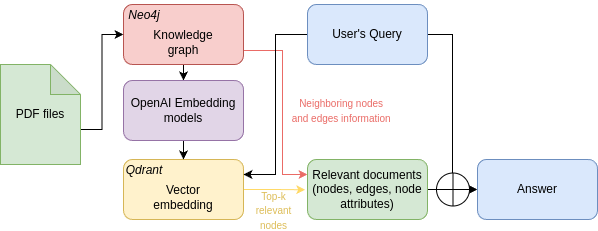
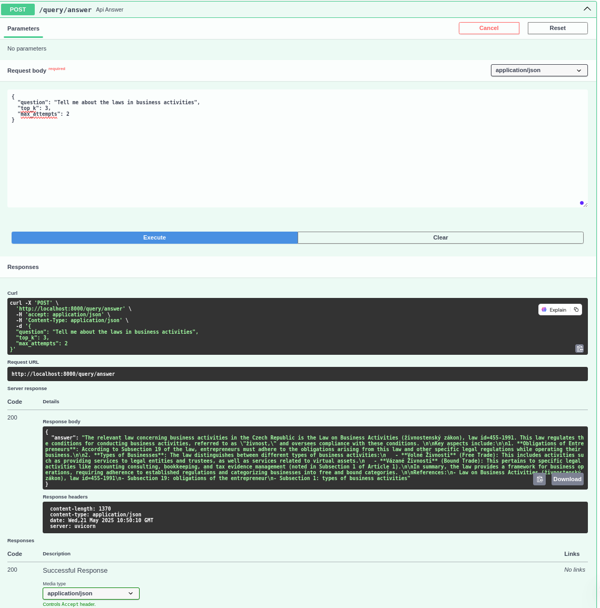

# Legal Knowledge Graph API

This homework project provides an API that allows querying a legal knowledge graph built using **Neo4j** and **Qdrant**. It leverages **Azure OpenAI** to generate legal answers based on the context from the knowledge graph.

---

## 1. Installation

### Prerequisites
To get started with this project, make sure you have the following installed:

- **Python 3.10+**
- **Neo4j**: A graph database to store the legal knowledge graph.
- **Qdrant**: A vector database for storing and querying embeddings.
- **Docker** (optional but recommended): For deploying the service along with dependencies.

### Steps to Install

1. **Clone the Repository**
    ```bash
    git clone <repository_url>
    cd <repository_folder>
    ```

2. **Create a Virtual Environment** (optional but recommended)
    ```bash
    conda create -n env python=3.10
    conda activate env
    ```

3. **Install Required Dependencies**
    Use `pip` to install all the dependencies in the `requirements.txt` file.

    ```bash
    pip install -r requirements.txt
    ```

4. **Set up Environment Variables**

    Rename the `.env.example` file to `.env`, filling in the appropriate keys.
    You will need to have API key and endpoint URL for OpenAI

---

## 2. File & Folder Structure

This project follows a modular structure to maintain clarity and separation of concerns.

```plaintext
.
├── pdf_data/              # Directory containing PDF files
├── json_output/           # Directory for storing JSON output extracted from PDFs
├── 1_pdf2json.py          # Script to extract JSON data from PDF files
├── 2_json2neo4j.py        # Script to ingest JSON data into Neo4j graph database
├── 3_qdrant_neo4j.py      # Script to create vector embeddings and ingest them into Qdrant
├── 4_qa_script.py         # Python script for asking and answering questions using the knowledge graph
├── main.py                # FastAPI app wrapping the Q&A pipeline into an API
├── requirements.txt       # Python dependencies for the project
├── .env                   # Environment variables (for database keys, API credentials)
├── .env.example           # Example .env file
└── README.md              # Project documentation
```
## 3. System flowchart



## 4. Run
1. **Extract information from pdfs in json format**
    ```bash
    python 1_pdf2json.py --input_folder pdf_data --output_folder json_output
    ```

2. **Ingest Json data into Neo4j** 
    ```bash
    # use docker to run a neo4j instance. user_name and password are those in .env
    docker run -d   --name neo4j   -p 7474:7474 -p 7687:7687   -e NEO4J_AUTH=user_name/password   neo4j:5
 
    python 2_json2neo4j.py --input_folder json_output
    # If you want to view the neo4j instance visually (locally): http://localhost:7474/browser/preview/

    ```

3. **Create Vector Embeddings and Ingest to Qdrant**
    ```bash
    # use docker to run a qdrant instance
    docker run -p 6333:6333 -p 6334:6334 -v "$(pwd)/qdrant_storage:/qdrant/storage:z" qdrant/qdrant
    python 3_qdrant_neo4j.py
    # After that, if you want to view the qdrant instance visually (locally): http://localhost:6333/dashboard#/collections
    ```

4. **Q&A Python script**
    ```bash
    python 4_qa_script.py

    Then type in the questions
    If you ask irrelevant questions (not related to laws), it will refuse to answer
    ```
5. **Run the FastAPI App**
    ```bash
    uvicorn main:app --reload --host 0.0.0.0 --port 8000
    ```
---
## 5. Result
After running FastAPI, you can insert a query and get result
